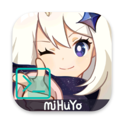

# HoYoGameSetup

A GUI way that helps you install HoYo games to your Mac.

## Requirement

- Apple Silicon (M1 and newer)
- macOS 14.4 and newer

Although you can install and open this app on macOS 14.4 and lower. 
But in fact, you can't enjoy the results brought by this software, which is meaningless.

## How to use

- Download the installation package (.dmg file) from the repository of this project and drag it to the application folder;
- Double-click to open it in the launchpad (if the developer of unknown source is prompted, go to the settings to open the software first);
- Follow the software prompts and wait for completion.

## Q&A

- Q: Will this app continue to be updated?
- A: It may be updated at any time, generally when the wine environment changes or the translation tool changes.

- Q: Will I face the risk of account blocking if I start the game with this software?
- A: Yes.

## Acknowledgement

Special thanks to [YuanShen_launcher_mac_porting](https://github.com/Coulin9/YuanShen_launcher_mac_porting). 
The development of this software is based on changing command line interaction to graphical interaction. 
At the same time, the core static resources of this software come from this project.

In addition, the birth of this software cannot be separated from the support of many open source software, 
especially [kotlin multiplatform](https://www.jetbrains.com.cn/kotlin-multiplatform/).

## Write at the end

- This software is an open source software, which is developed for the purpose of non-profit and learning computer software development knowledge. It does not include any guarantee. Your download, installation and use are voluntary, and we are not responsible for it.
- Please abide by the agreement of open source license and use this software rationally and rationally.
- <b>本项目仅接受以英语为文本提起的Issue。(This project only accepts issues raised in English.)</b>